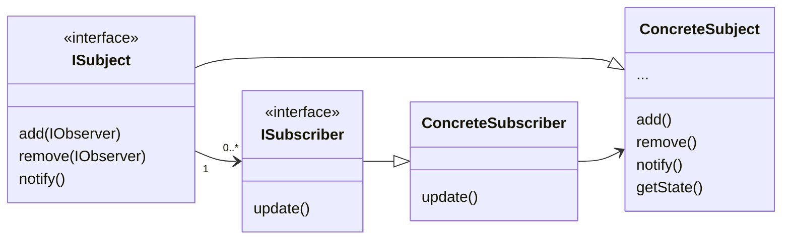
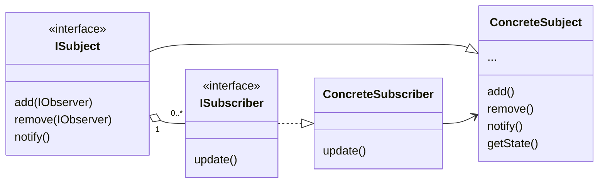

# _Design Patterns II_
## Observer Pattern - Version 1

____
## Observer Pattern - Version 2
Now the relationship between the interfaces is an actual association,
and the relationship between the ISubscriber (IObserver) and the ConcreteSubscriber is that of an _Implementation_, and not of inheritance (_notice how the update method has to be implemented in the concrete observer as well_).

____
Both schemes are almost the same. As a matter of fact, the differences are so slight that in a realcase scenario I wouldn't be able to take them appart.