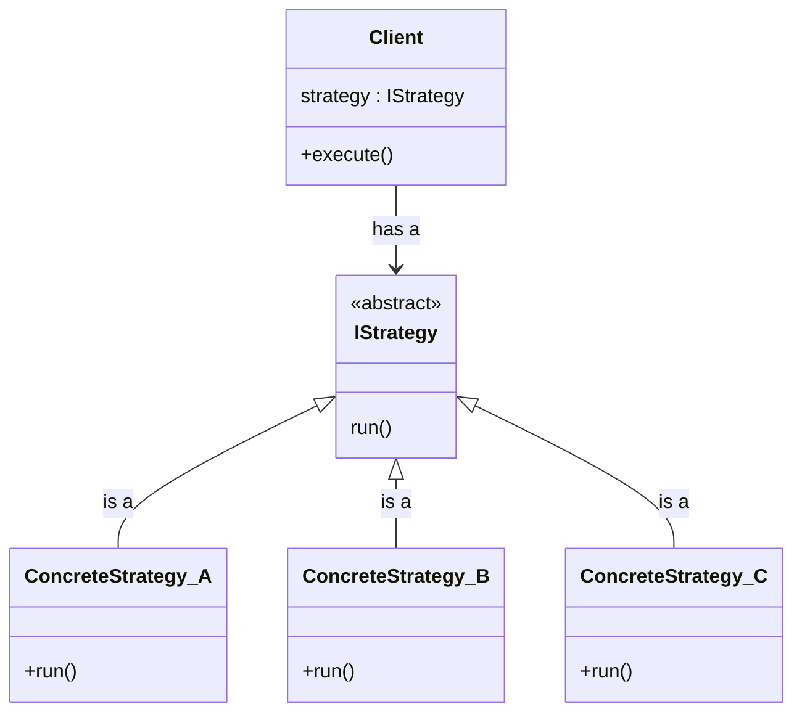

```mermaid
    classDiagram
    direction BT
    IStrategy <-- Client  : has a
    class IStrategy{
        <<abstract>>
        run()
    }
    class Client{
        strategy : IStrategy
        +execute()
    }
    ConcreteStrategy_A --|> IStrategy : is a
    ConcreteStrategy_A : +run()
    ConcreteStrategy_B --|> IStrategy : is a
    ConcreteStrategy_B : +run()
    ConcreteStrategy_C --|> IStrategy : is a
    ConcreteStrategy_C : +run()
```